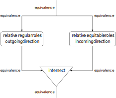
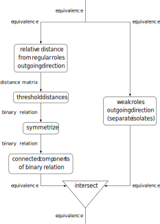

# Design overview

This document presents an overview of the design of the netroles library. It is organized in two parts:

* The first part covers the underlying theory on role equivalences in the area of Social Network Analysis.
* The second part explains the dataflow-driven design of the library on a high level.

## Theoretical background

The netroles library builds on and implements ideas and concepts described in [Müller and Brandes (2022). The evolution of roles. Social Networks 68:195-208.](https://doi.org/10.1016/j.socnet.2021.02.001). This section gives a very brief introduction of these concepts. For a more detailed treatise, please consider the linked paper.

Consider an undirected graph $G=(V, E)$ with $n = |V|$ vertices and $m=|E|$ vertices, and let 
$$E(i) := \{ \{i, j\} \in E \}$$
denote the set of edges incident to a vertex $v$. Classic notions of role equivalence are based on comparing sets of incident edges: They consider two vertices $i$ and $w$ equivalent if all incident edges $E(i)$ of $i$ can be matched or substituted by incident edges $E(j)$ of $j$ and vice versa. The difference between the different definitions of role equivalence then lies in the conditions under which incident edges can be matched.

Some established notions of role equivalence condition matchings only on fixed properties of involved neighbors and edges or how often each edge can at most act as a match or substitute for other edges. Other common notions, most importantly the renowned concept of regular equivalence, make the matching dependent on the role equivalence itself. For example, regular equivalence stipulates: Two vertices can be regularly equivalent only if they have regularly equivalent neighbors. Such notions of role equivalence are self-referential in their definition.

[Müller and Brandes (2022)](https://doi.org/10.1016/j.socnet.2021.02.00) suggest to break up this self-referentiality by defining the concept of a *role equivalence relative to a given equivalence*: Two vertices $i$ and $j$ are role-equivalent relative to a given equivalence if the incident edges $E(i)$ of $i$ can be matched with the incident edges $E(j)$ of $j$ conditioned on the given equivalence and vice versa. 

The relative role equivalence operation yields an equivalence which could potentially be ordered arbitrarily compared to the given equivalence with respect to the usual refinement ordering of equivalences. Instead, we might prefer that the next role equivalence is either a refinement or a coarsening of the initial one. This suggests the definition of two more operations:
* The *role restriction* is the intersection of a given equivalence with the role equivalence relative to the same equivalence.
* The *role extension* is the join (transitive closure of the union) of a given equivalence with the role equivalence relative to the same equivalence.

Each of the three operations yield a new role equivalence relative to a prior equivalence based on the comparison of incident edges and neighborhoods. We could then feed this new equivalence again into relative role equivalence. By doing so repeatedly, we obtain a sequence of role equivalences, which could be viewed as an idealized process of role evolution.

At some point, this process is guaranteed to enter a cycle. One special kind of cycle is one of length one, a fixed point where the respective operation yields the same equivalence again. If one of the three operations does not change an equivalence, then we say that this is a *stable role equivalence with respect to this operation*.

In the case of role restriction and role extension, all processes end at a stable role equivalence. Thus, we can define two more operations:

* The *interior* of an equivalence is the limit of the process under role restriction started at this equivalence. This is the coarsest stable role equivalence w.r.t. role restriction that refines the given equivalence.
* The *closure* of an equivalence is the limit of the process under role extension started at this equivalence. This is the finest stable role equivalence w.r.t. role extension that coarsens the given equivalence.

These five operations map to the methods of the `RoleOperator<T>` interface as follows:

| operation        | `RoleOperator<T>` method |
| ---------------- | ------------------------ |
| relative roles   | `relative()`             |
| role restriction | `restrict()`             |
| role extension   | `extend()`               |
| interior         | `interior()`             |
| closure          | `closure()`              |

The established notions of role equivalence correspond to the stable role equivalences with respect to relative role equivalence, role restriction and role extension. The following table summarizes this relation of stable role equivalences to established notions of role according to the used matching criteria in pairwise comparisons (see [Müller and Brandes, 2022](https://doi.org/10.1016/j.socnet.2021.02.00)). It demonstrates that established role equivalences differ in (a) the employed matching criteria for pairwise neighborhood comparisons and (b) which of the three operations relative role equivalence, role restriction and role extension they are stable under. However, it also generalizes: By choosing suitable matching criteria, nuanced notion of roles more appropriate for the study at hand could be specified. For example, more aspects of network data could be incorporated into role analysis, for example by choosing matching criteria that take into account attributes on vertices and edges.


| matching criteria <br/> when comparing $i$ and $j$    | relative role equivalence | role restriction | role extension |
| -------------------- | ------------------------- | ---------------- | -------------- |
| no restrictions      | weak role equivalence <br/> [(Winship and Mandel, 1983)](https://doi.org/10.2307/270911) | refinements of weak role equivalence | coarsenings of weak role equivalence |
| each edge can be a match at most once | weak equitable equivalence / degree equality | refinements of weak equitable equivalence | coarsenings of weak equitable equivalence |
| same neighbors       | strong structural equivalence <br/> [(Lorrain and White, 1971)](https://doi.org/10.1080/0022250X.1971.9989788)| refinements of strong structural equivalence | coarsenings of strong structural equivalence |
| tie to $j$ incident of $i$ matched with tie to $i$ incident to $j$, both $i$ and $j$ or neither have loops, otherwise same neighbors | weak structural equivalence <br/>[(Everett et al., 1990)](https://doi.org/10.1080/0022250X.1990.9990067) | refinements of weak structural equivalence | coarsenings of weak structural equivalence |
| equivalent neighbors | perfect equivalence <br/> [(Borgatti and Everett, 1994)](https://doi.org/10.1016/0378-8733(94)90010-8) | regular equivalence <br/> [(White and Reitz, 1983)](https://doi.org/10.1016/0378-8733(83)90025-4) | ecological equivalence <br/> [(Borgatti and Everett, 1992)](https://doi.org/10.1016/0378-8733(92)90006-S) | 
| equivalent neighbors, each edge can be a match at most once | equitable perfect equivalence <br/> [(Everett and Borgatti, 1996)](https://doi.org/10.1016/0378-8733(95)00286-3) | equitable regular equivalence <br/> [(Everett and Borgatti, 1996)](https://doi.org/10.1016/0378-8733(95)00286-3) | equitable ecological equivalence <br/> [(Everett and Borgatti, 1996)](https://doi.org/10.1016/0378-8733(95)00286-3) |
| according to graph automorphisms | automorphic equivalence <br/> ([Everett, 1985](https://doi.org/10.1016/0378-8733(85)90013-9); [Winship, 1974/1988](https://doi.org/10.1016/0378-8733(88)90013-5)) | refinements of automorphic equivalence | coarsenings of automorphic equivalence |


> &#9432; ***Note***
>
> Currently, the library does not implement automorphic equivalence. This is because it is unclear how to decompose automorphic equivalence to resolve the self-referentiality in such a way that a natural definition of relative role equivalence is obtained. Moreover, no polynomial-time algorithm is currently known for the graph automorphism problem.


## Library design principles

Following the discussion in the previous section, five operations underlie role equivalence analysis: Relative role equivalence, role restriction, role restriction, interior and closure. A straightforward implementation could implement each of these operations as methods with some configuration options, perhaps additionally divided by the closest type of established role equivalence.

However, such a design has drawbacks. The main one concerns generality and extensibility: Each of these methods will offer a set of configuration options to adjust the role equivalence concept to the demands of network data and user. However, such a set of configuration options will always only be able to cover some scenarios. When the requirements of the study are outside these supported cases, the provided procedures cannot handle them, forcing users either to settle on a suboptimal notion of role or to rewrite the library code to add those configuration options they need. This runs counter to one of the aims of the formalization proposed in [Müller and Brandes (2022)](https://doi.org/10.1016/j.socnet.2021.02.00), namely the capability to specify novel or nuanced notion of role appropriate for the study at hand.

Adding more and more configuration options to the procedures to support more scenarios, however, results in a starker and starker increase in implementation complexity, making it difficult to argue the code's correctness, to keep track of the various interactions of configurations and program, or test the program sufficiently.

Due to these disadvantages, the netroles library rather implements a design inspired by the data-flow and functional programming paradigms.

This design first builds on the insight that relative role equivalence is the fundamental operation for role analysis: The other options can all be derived from it straightforwardly. Thus, it is sufficient that users can specify the relative roles operation in a powerful way.

The relative roles operation takes a role structure and producing a role structure. Instead of incorporating all possible configurations into a single method implementing this operation, the library rather models the operation as a graph of unary operators, where the connections between the unary operators describe how the output of one operation feeds as argument to another. Such a graph defines how the operators are composed and in which order they have to be executed. If such a graph has the representation of a role structure (equivalence, or relaxations such as rankings or binary relations) as its global input and output, then we can treat it as a relative roles operations and also derive the other three role-related operations from it.

> &#9432; ***Example***
>
> The following code defines a composed operator establishing equivalence according to the notion of regular roles in outgoing direction and according to equitable roles in incoming direction, joining the result of both directions through intersection:
>
> ```java
> RoleOperator<ConstMapping.OfInt> bidiRegularOp = Operators.parallel(
>   // apply the unidirectional operators in parallel
>   // and combine them through intersection
>   // (which is the meet of the equivalence lattice)
>   Reducers.EQUIVALENCE.meet(), 
>   RoleOperators.EQUIVALENCE.regular()
>     .of(outgoingNetworkView).make(), // regular roles operator in outgoing direction only
>   RoleOperators.EQUIVALENCE.equitable()
>     .of(incomingNetworkView).make(), // equitable roles operator in incoming direction only
> );
> ```
>
> This results in a composed operator that corresponds to the following dataflow graph:
>
> 


> &#9432; ***Example***
> 
> Assume that the application requires the definition of an error-tolerant role equivalence. It could be dervied the following individual steps:
>
> * First, a matrix of deviations from role equivalence, that is the number of mismatches in the pairwise comparison in each direction, is computer.
> * Second, these deviations are thresholded by one, allowing up to one mismatch in each direction of comparison.
> * The resulting binary relation is symmetrized, ensuring that the number of mismatches must be at most one in both directions of pairwise comparison.
> * An equivalence is obtained by transitively closing the binary relation, or equivalently by determining its connected components.
> * Finally, isolates could be seaparated, because the deviation from role equivalence are not due to mismatches, but due to the impossibility of matching with anything incident.
>
> The following code defines a role operator composed from these individual operations:
> 
> ```java
> RoleOperator<ConstMapping.OfInt> errortolerantOp = Operators.parallel( //
>   Reducers.EQUIVALENCE.meet(), //
>   Operators.composeRoleOp( //
>     Operators.composeOp( //
>       Operators.composeOp( // threshold pairwise distances from equitable equivalence by one
>         DistanceOperators.EQUIVALENCE.equitable().of(networkView).make(),
>         Converters.thresholdDistances((i, j) -> 1)),
>       // symmetrize (at most distance one in both directions)
>       RoleOperators.BINARYRELATION.basic().symmetrize()),
>     Converters.strongComponentsAsEquivalence()), // close on symmetric comparisons transitively
>   RoleOperators.EQUIVALENCE.weak().of(n, networkView).make()); // and split off isolates
> ```
> This corresponds to the following dataflow diagram:
>
> 
>
> Observe that not all intermediate results are equivalences. Rather, intermediate data can potentially be of any format. As long as the final input and output are role structures (and the appropriate composition operation is applied), the result will be an operator offering the usual role operations.
> 
> You can find a more detailed explanation and usage example of this operator [here](./USAGE.md#error-tolerant-role-notions).

This dataflow-based design presents a number of benefits, particularly in achieving the following aims:

* **Declarative**: Users only have to declare the components of the role notion of interest through and compose them appropriately. However, it does not have to be expressed how all these components are computed individually or how the control flow expressed by the composition is actually performed.
* **Expressivity** and **generality**: The approach greatly extends the possibilities for expressing complex role notions. Nuanced role notions, for example accounting for various aspects of network data or varying the neighborhood comparisons in a suitable way, can be expressed by decomposing them into smaller subtasks. Operators solving these subtasks can then be composed appropriately to obtain the desired role operator.
* **Separation of concerns**: Instead of lots of configuration options, individual operators can be designed to address well-defined tasks with a narrow interface. More complex cases can often be exprssed by combining an operator with a few others appropriately.
* **Extensibility**: If some role notion cannot be expressed using the operators of the library, the user often only has to implement a small set of additional operators. They can then be seamlessly composed with operators offered by the library, minimizing the additional implementation work.
* **Testability**: Since the operators usually have a well-defined and narrow interface, they can be tested exhaustively with unit tests. Similarly, exhaustive unit tests for operator composition is feasible. If all of the components of composed operators are well-tested, there can then be confidence in the correctness of composed operators. On the other hand, it is unlikely that methods with many settings would be tested for all possible interactions between these settings.
* **Optimization opportunities**: The dataflow-based design lends itself to a few natural optimizations. Currently, the library exploits the following optimizations to some degree:
    * ***Constant folding and caching***: If possible, operations are ordered such that operators with constant output are folded and the result of the folding is cached.
    * ***Lazy evaluation***: In some cases, the computation of intermediate results is postponed or only performed to the degree subsequent operators need these results.